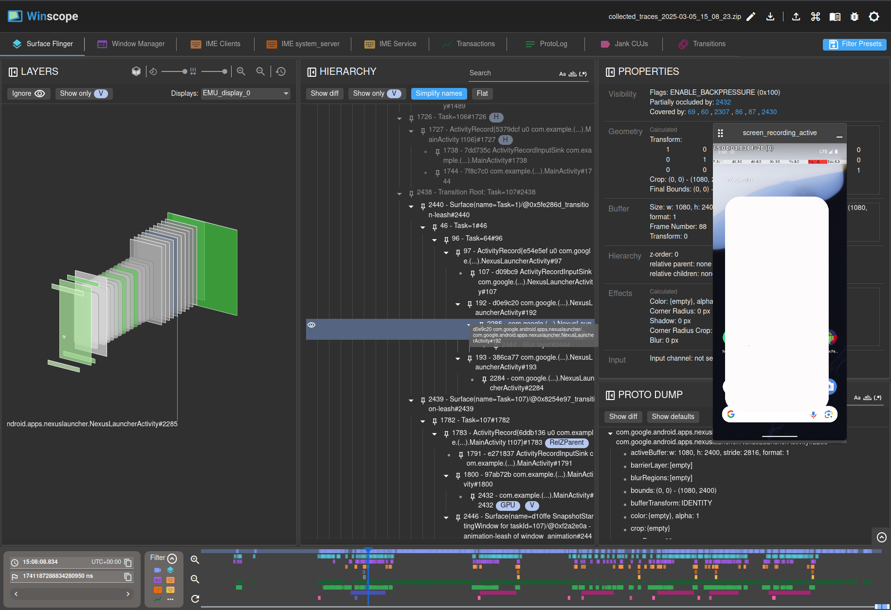

# WinscopeSetup

English|[中文](README.MD)

Possibly the minimal requirements for building `winscope` independently.

## Repositories reqiured

+ frameworks/base: https://android.googlesource.com/platform/frameworks/base
+ development: https://android.googlesource.com/platform/development
+ external/perfetto: https://android.googlesource.com/platform/external/perfetto
+ frameworks/proto_logging: https://android.googlesource.com/platform/frameworks/proto_logging
+ frameworks/libs/systemui: https://android.googlesource.com/platform/frameworks/libs/systemuis

## Branch

Now based on branch `android15-qpr2-release` from `aosp`.

## Compile

### Automatically

Use the [script](setup.sh) I provide to compile.

```bash
./setup.sh
```

### Manually

1. Download all the repositories above

```bash
git clone -b android15-qpr2-release https://android.googlesource.com/platform/frameworks/base frameworks/base --depth=1
git clone -b android15-qpr2-release https://android.googlesource.com/platform/development development --depth=1
git clone -b android15-qpr2-release https://android.googlesource.com/platform/external/perfetto external/perfetto --depth=1
git clone -b android15-qpr2-release https://android.googlesource.com/platform/frameworks/proto_logging frameworks/proto_logging --depth=1
git clone -b android15-qpr2-release https://android.googlesource.com/platform/frameworks/libs/systemui frameworks/libs/systemui --depth=1
```

2. Go into `development/tools/winscope`, then compile

```bash
npm install
npm run build:prod
```

## Complete!

Go to `development/tools/winscope`，just run `npm run start` to start it. And don't forget to run `adb proxy` using `python3 src/adb/winscope_proxy.py`.

